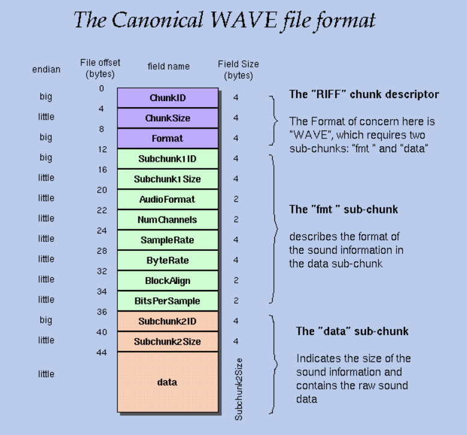

# FPGA-Wav-Player
FPGA Wav Player by Christopher Spadavecchia &amp; Eli Shtindler

This is our final project for CPE 487 taught by Professor Bernard Yett, shoutout to him. 

The goal of our project is to be able to play a .wav file on the Nexys A7 FPGA.

To be able to achieve this goal, we had to download the .wav file to a Micro SD, read the file from the Micro SD, and play back the data from the file.
## 1. Figuring out the .wav (Wave) format using Python
To be able to read the Wave file format, we have to figure out how the song is formatted. To do this, we employed Python to extract and print out information from the .wavfile.

All the information that we used for the Wave file format, we found on this webiste: [WAVE PCM soundfile format](http://soundfile.sapp.org/doc/WaveFormat/).

The WAVE format is a part of Microsoft’s RIFF(Resource Interchange File Format) standard for multimedia file storage.

A RIFF file starts out with a file header followed by a sequence of data chunks. A WAVE file is often just a RIFF file with a single "WAVE" chunk which consists of two sub-chunks: a "fmt "chunk which describes the sound data's format and a "data" chunk containing the actual song data that we want to read.

From the "fmt" chunk we had to extract and print certain components to figure out the format of the song data. The componets that we used and there settings for our test song, "Again by Fetty Wap" are list below.

**NumChannels** - etermines if it was 1 = Mono or 2 = Stereo. -> Project Settings: 2 = Stereo

**SampleRate** - determines how fast samples are taken -> Project Settings: 48,000 Hz

**BitsPerSample** - determines how many bits are in sample usually its 8 or 16 bits -> Project Settings: 16 bits

**ByteRate** - equal to SampleRate * NumChannels * BitsPerSample/8 -> Project Settings: 48000 * 2 * 16/8 = 192,000 bytes per second

From the "data" chunk we had to extract and print certain components to see when the data started, so we could start reading the data.

**Subchunk2ID** - contains the letters "data"(0x64617461 in big-endian form)

**Subchunk2Size** - equal to NumSamples * NumChannels * BitsPerSample/8 and is equal to the number of bytes in the data   -> Project Settings: 1,400,000 samples * 2 * 16/8 = 5,600,000 bytes

We looped through the data until we found the Subchunk2ID which indicated to us that the data started here and we could start reading the data.

## 2. Reading the File from the Micro SD card

Since the FPGA cannot store the .wav file, we had to employ a Micro SD card to be our storage.

To be able to read the Micro SD card, we looked for source code to implement and came across this project: 
[Micro SD Reader](https://github.com/douggilliland/MultiComp/blob/master/MultiComp%20(VHDL%20Template)/Components/SDCARD/sd_controller_High_Speed.vhd).

This covers the physical layer of communication between the SD Card and the FPGA.

There are two possible options of communication between the SD Card and the FPGA: SD communication and SPI(Serial Peripherical Interface).

We are using SPI because it has a simpler interface to use, however, it is slower than SD communication. SPI serializes outgoing byte data for transmission while deserializing incoming data back into bytes.

The Micro SD card features eight pins in total; however, when operating in SPI mode, only six of these pins are utilized, as Pins 1 and 8 are not required.

**Pin 2** is for **chip selection**, which is an active low process that enables the Micro SD card. (0 = SD card activated, 1 = idle)

**Pin 3** is for **incoming data**, which carries data from the Micro SD card to the FPGA during communication.

**Pin 4** is for **VDD**, which carries the positive supply voltage needed to power the Micro SD card’s internal circuitry.

**Pin 5** is for **serial clock**, which synchronizes data transmission between the FPGA and the Micro SD Card.

**Pin 6** is for **VSS**, which carries the negative supply or ground reference for the Micro SD card’s electrical circuitry.

**Pin 7** is for **outgoing data**, which carries data from the FPGA to the Micro SD card during communication.

The code we implemented will allow us to use these data pins to send data from the Micro SD card to the FPGA.

Now, we have to locate the file in the Micro SD card. To locate the file, we used a Mealey Finite State Machine. The Mealey Finite State Machine goes through the following procedure.

1. First, it reads the **master boot record** that tells us the location of the file paritions on the Micro SD card. For our project, we only had one partition on the Micro SD Card, giving us only option for the location. This one partition is formated using the **File Allocation Table 32 system** or the **FAT32 system** for short. 

2. We read the partition start sector the master boot record and use the address it gave us to find the start of the **BIOS peramater block (BPB)** This BPB contains information about the FAT32 File Systen needed to locate our file. 

3. The values needed from the BPB are the **sectors per cluster**, **resereved sectors**, **FAT copies**, **sectors per FAT**, and the **starting cluster**.

4. Next, we calculate the index first sector of the FAT in the data using the following equation: current location(first sector of the partition) + number of reserved sectors.

5. 

