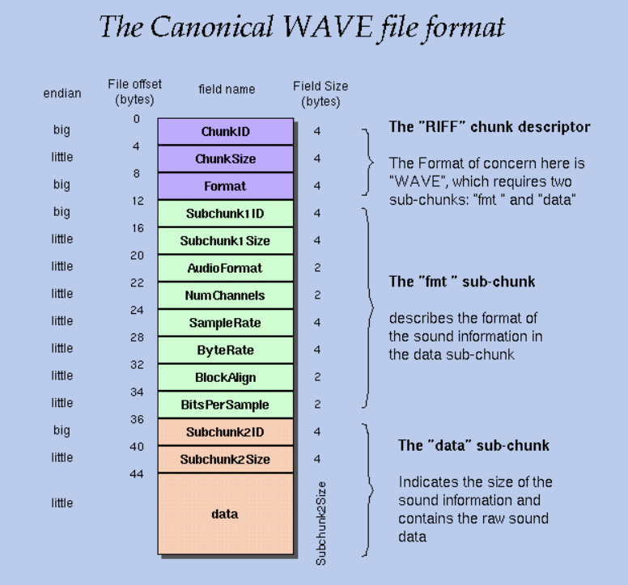

# FPGA-Wav-Player
FPGA Wav Player by Christopher Spadavecchia &amp; Eli Shtindler

This is our final project for CPE 487 taught by Professor Bernard Yett, shoutout to him. 

### Table of Contents:
[Project Description](#project-description)

[Usage Instructions](#how-to-run-the-project)

[Project Inputs and Outputs](#project-inputs-and-outputs)

[Process Description](#process-description)

[Difficulties](#difficulties)

## Project Description
The goal of our project was to be able to play music files on the Nexys A7-100T board. We were able to accomplish this by reading WAV files from a microSD card and playing them through a DAC interface. The program should play all of the WAV files in the root directory of the microSD cards, looping back to the start once all files have been played.

## How to Run the Project
1) Create a new Vivado project and add the Common.vhd, music_player.vhd, wav_playback.vhd, sd_reader.vhd, SDCard.vhd, dac_if.vhd, and music_player.xdc files.
2) Format a microSD card with a FAT32 filesystem.(The project should work with any microSD card, but was only tested with an 8 GB SDHC card)
3) Upload the WAV files that you want to play to the card. These files must be in the main directory, not a subfolder.
4) Insert the microSD card into the Nexys board.
5) Connect a [Pmod I2S2](https://digilent.com/shop/pmod-i2s2-stereo-audio-input-and-output/) to port JA and attach your audio device to the out line.
6) Compile the project in Vivado and upload the program the board

## Project Inputs and Outputs
In order the drive the processes in the program, a clock signal generated the the Nexys board was used. The clock was set to a frequency of 50 MHz. Four connections were required to interact with with SD card. These are the serial clock, chip select, data in, and data out lines. The Pmod I2S2 interfacing was copied from [Lab 5](https://github.com/byett/dsd/tree/CPE487-Spring2025/Nexys-A7/Lab-5) and required another four outputs. Lastly, UART communication was used during testing to print values. This only required the UART_RXD_OUT signal.

## Process Description
The development for the project was seperarated into three main stages: interfacing with the microSD card, traversing the FAT32 filesystem, and playing the wav file.

### 1. Interfacing with a microSD card
The Nexys A7 does not have any built in file storage, so an outside file storage device was needed. The board does have a microSD card connector, so that was chosen for storing our audio files.

MicroSD cards can be interfaced in two modes: SD bus protocol and SPI. With SD bus protocol, four datalines are used that can switch between input and output, while in SPI only two data lines are used that are reserved for input and output. The protocol for SD and microSD cards are the same, with the only differencing being how the pins are arranged on the card. Luckily, working with an SD card is a common task, and many implementations were found online for SD card interfaces. [Grant Searle's SD card interface](https://github.com/douggilliland/MultiComp/blob/master/MultiComp%20(VHDL%20Template)/Components/SDCARD/sd_controller_High_Speed.vhd) was used for this project. This code handled the physical layer of interfacing with the SD card, but the logic to read from the SD card still had to be implemented. The steps to read one sector (512 bytes) are writing the three address bytes to be read from, issuing a read command, and reading in each of the 512 bytes. In between each of these steps, the SD status must be checked to make sure that the SD card has finished processing the previous command. 

The above FSM was designed to perform a read from the SD card. Its implementation can be seen in sd_reader.vhd. This allows a read to be performed by simply setting the address signal and setting read signal high. In order to store the data, a new variable type called CHAR_ARRAY was created. A CHAR_ARRAY is simply an array of 8 bit std_logic_vectors, which make represent byte data easier. sd_reader outputs to a 512 byte array, which is read from in other files. The constraints needed for the SD card were found in the master constraints file and the four signals needed were added to our project.

### 2. Traversing the FAT32 filesystem
When any storage device is used, a filesystem is needed for a computer to be able to properly locate and read the files. The FAT32 format is a standard filesystem commonly used for smaller capacity storage devices such as SD cards. The FAT32 filesystem splits files up into clusters, storing the locations of the clusters as a linked list in a file allocation table (FAT). In order to read a file, you start at the first cluster obtained from a directory entry. Once you have finshed reading all sectors in the cluster, the FAT entry at the currently cluster number will have the next cluster number of the file. This continues until an end of chain indicator is reached in the FAT, which shows that the file has ended. This system allows files to be stored in non-contiguous memory, making the filesystem more adaptable.

.png>)

The above FSM was designed to perform the task of reading through the filesystem and reading through the SD card. Its implementations can be seen in music_player.vhd. The FSM first reads the Master Boot Record (MBR), which contains info on the partitions in the storage device. The first partition of the drive is always read from in our project. Then the Bios Parameter Block (BPB) is read. This contains information about the filesystem, such as the number of sectors per cluster, size of the FAT, location of the starting cluster, and more. These values are critical for successfully reading files. The program then begins going through each file entry in the main directory of the microSD card. Once a WAV file ending is found, it begins reading the file and sets the reading_file signal high, which indicates that music playback should begin. Subfolder are not traversed and any non WAV files are just skipped. Once the entire main directory is read through, the FSM re-initializes itself, looping back to the start.

### 3. Figuring out the WAV (Wave) format
We initially wanted to use MP3 files in our projects, but after trying to decode it in Python, we realized that performing MP3 decoding would be a very difficult process. We instead decided to go for WAV files, which contain unencoded waveform data that can be send directly to a DAC.
To be able to read the Wave file format, we have to figure out how the song is formatted. To do this, we employed Python to extract and print out information from the WAVfile.

All the information that we used for the Wave file format, we found on this website: [WAVE PCM soundfile format](http://soundfile.sapp.org/doc/WaveFormat/).

The WAVE format is a part of Microsoft’s RIFF(Resource Interchange File Format) standard for multimedia file storage.

A RIFF file starts out with a file header followed by a sequence of data chunks. A WAVE file is often just a RIFF file with a single "WAVE" chunk which consists of two sub-chunks: a "fmt "chunk which describes the sound data's format and a "data" chunk containing the actual song data that we want to read.

From the "fmt" chunk we had to extract and print certain components to figure out the format of the song data. The components and settings that we used for our test song, "Again by Fetty Wap" are listed below.

**NumChannels** - determines if it was 1 = Mono or 2 = Stereo. -> Project Settings: 2 = Stereo

**SampleRate** - determines how fast samples are taken -> Project Settings: 48,000 Hz

**BitsPerSample** - determines how many bits are in sample usually its 8 or 16 bits -> Project Settings: 16 bits

**ByteRate** - equal to SampleRate * NumChannels * BitsPerSample/8 -> Project Settings: 48000 * 2 * 16/8 = 192,000 bytes per second

From the "data" chunk we had to extract and print certain components to see when the data started, so we could start reading the data.

**Subchunk2ID** - contains the letters "data"(0x64617461 in big-endian form)

**Subchunk2Size** - equal to NumSamples * NumChannels * BitsPerSample/8 and is equal to the number of bytes in the data   -> Project Settings: 1,400,000 samples * 2 * 16/8 = 5,600,000 bytes

After the reading the fmt subchunk, the WAV playback FSM checks the next subchunks. If they are not a data subchunk, they are skipped and the next subchunk is read until the data subchunk is found. In order to play the data back a the correct speed, the FSM was synced to a counter. This counter incremented by the sample rate each clock cycle and was reset when it surpassed the clock speed * number of channels. On each reset of this counter, the FSM would read a new sample, ensuring that the playback speed matched to the data contained in the WAV file.

## Difficulties
One of the major challenges encountered when starting the project was monitoring the state of the program during runtime. The only intended output for the program is the audio from the WAV file, but this is one of the last parts of the program to actually execute. If an error is encountered before this, then the program would just fail with no output. In order to solve this issue, UART communication was set up to print values like the current address, SD status, and data read from the SD card to a serial terminal. [This demo project from Diligent](https://digilent.com/reference/programmable-logic/nexys-a7/demos/gpio) had the base code for UART communication. 

The demo was modified to print out the data that we wanted to monitor during runtime. The files top.vhd and top.xdc were used during testing and still contain the UART code. UART_TX_CTRL.vhd was taken directly from the demo project and has no modifications. [PuTTY](https://www.chiark.greenend.org.uk/~sgtatham/putty/) was used to create the serial monitor on the host computer. Sending messages over UART was quite slow and effectively acted like delays in the program. This had an unforseen consequence, as one of these delays was actually needed for the program to function. After taking the prints out of the code, the program failed about half of the time. This issue took a long time to figure out, but eventually we were able to realise that it was the delay caused by printing out the address before reading from the SD card that fixed this issue. There seemed to be a race condition on the first read from the SD card after initialization that would only sometimes cause issues. This problem was remedied by adding in a delay state to the sd_reader FSM.

A large amount of the time spent on this project was learning about the format standards for FAT32 and WAV. These are popular formats with a large amount of resources covering them, but there are not as many FPGA implementations. Thus the specifics of these formats had to be well understood in order to create a method for processing them in a VHDL compatible manner. Several outside tools were helpful in this effort. [HxD](https://mh-nexus.de/en/hxd/) was used to manually view the contents of the SD card and enusre that the correct values were actually being read. It also helped in tracing out the logic for traversing the filesystem as files could be located manually to ensure that they lined up with how the code would be calculating the file locations. Python was used to parse sample WAV files and double check that data contained in the file. It helped to find that there were subchunks other than just the fmt and data. Finding this issue in a higher level language like Python first made troubleshooting it much easier. Additionally implementing the logic in Python first made the transition to VHDL a little bit easier.

## Conclusion

### Summary
This project successfully demonstrated the ability to play WAV audio files on the Nexys A7-100T FPGA by interfacing with a microSD card using the SPI protocol, navigating a FAT32 filesystem, and decoding WAV format audio for playback through a Pmod I2S2 DAC. Key components included custom VHDL implementations for SD card communication, filesystem traversal, and WAV data parsing and playback. Overcoming challenges such as debugging without immediate feedback, handling timing issues, and understanding complex file standards like FAT32 and WAV required extensive research and creative problem-solving. Tools like Python, UART, and HxD were instrumental in developing and verifying each stage of the project. Ultimately, this project highlights the power and flexibility of FPGAs for real-time multimedia processing and provided valuable hands-on experience with hardware-software integration, digital communication protocols, and embedded system design.

